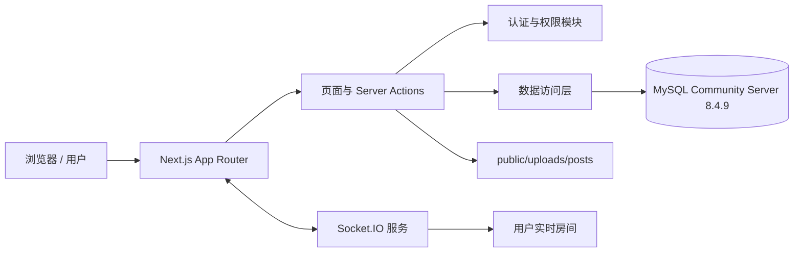

# BBS 星桥社区

一个面向校园交流场景的现代化 BBS 论坛系统。项目使用 Next.js App Router 构建前后端页面，通过 MySQL 保存业务数据，使用 Session Cookie 完成身份认证，并通过 Socket.IO 实现私信与通知的实时刷新。

> 当前主分支为 Next.js + MySQL 版本，适合本地运行、课程设计演示和 Node.js 服务器部署。

## 目录

- [项目特点](#项目特点)
- [功能模块](#功能模块)
- [技术栈](#技术栈)
- [系统架构](#系统架构)
- [页面与路由](#页面与路由)
- [快速开始](#快速开始)
- [环境变量](#环境变量)
- [数据库说明](#数据库说明)
- [演示账号](#演示账号)
- [项目目录](#项目目录)
- [可用命令](#可用命令)
- [安全设计](#安全设计)
- [部署说明](#部署说明)
- [常见问题](#常见问题)
- [分支说明](#分支说明)

## 项目特点

- **完整论坛流程**：板块浏览、帖子发布、图片上传、回复、点赞、收藏、搜索和排行榜。
- **用户系统**：邮箱注册登录、密码加密、Session 会话、密码重置、个人主页和积分等级。
- **社交功能**：好友申请、私信会话、未读通知和实时消息刷新。
- **后台管理**：用户、角色、板块、帖子、评论、举报、公告和审计日志管理。
- **实时通信**：Socket.IO 按用户房间推送私信和通知事件。
- **响应式界面**：适配桌面端和移动端，支持浅色/深色主题。
- **中英文切换**：界面语言可在中文和英文之间切换。
- **动态交互**：使用 Motion 实现页面过渡和操作引导，使用 Three.js 绘制动态背景。
- **本地数据回退**：未配置 MySQL 时，部分只读页面可使用项目内置演示数据展示。
- **一键启动**：PowerShell 脚本可检查 MySQL、初始化数据库并启动项目。

## 功能模块

### 普通用户

| 模块 | 功能 |
| --- | --- |
| 账号认证 | 注册、登录、退出、Session 状态检查、密码重置 |
| 首页 | 社区统计、活跃板块、推荐帖子、在线用户统计 |
| 板块 | 浏览全部板块、查看板块详情和板块帖子 |
| 帖子 | 发布主题、上传图片、查看详情、回复、点赞、收藏、举报 |
| 搜索 | 按关键词检索帖子内容 |
| 排行榜 | 用户积分榜、热门主题榜 |
| 个人主页 | 查看用户资料、等级、积分和发布记录 |
| 好友与私信 | 发起好友申请、接受或拒绝申请、发送实时私信 |
| 通知 | 查看回复、好友、系统和举报通知，一键标记已读 |
| 个性化 | 深浅主题、中英文界面、动态引导 |

帖子图片支持 `JPEG`、`PNG`、`WebP` 和 `GIF`，单张图片最大为 5 MB，默认保存在 `public/uploads/posts/`。

### 管理员与版主

后台入口为 `/admin`，`admin` 和 `moderator` 角色可以进入管理区域。

| 后台模块 | 功能 |
| --- | --- |
| 用户管理 | 查看用户信息、调整用户角色 |
| 角色管理 | 新建、编辑、删除未被使用的角色 |
| 板块管理 | 编辑板块名称、分组、说明、图标、主题色和排序 |
| 帖子管理 | 调整帖子为推荐、置顶或普通状态 |
| 评论管理 | 控制回复的显示与隐藏 |
| 举报管理 | 查看举报并标记为已处理或已驳回 |
| 公告管理 | 发布全站公告或板块公告 |
| 系统日志 | 查询后台操作审计记录 |

## 技术栈

### 核心环境

| 技术 | 版本/说明 |
| --- | --- |
| Node.js | 20 或更高版本 |
| Next.js | 16.2.6，App Router |
| React | 19.2.0 |
| TypeScript | 5.9.3 |
| MySQL | 开发机实际安装 MySQL Community Server 8.4.9 |
| MySQL 驱动 | `package.json` 声明 `^3.15.3`，当前实际安装 3.22.4 |
| Socket.IO | 4.8.1 |

### 前端与工程化

| 技术 | 用途 |
| --- | --- |
| Tailwind CSS | 页面样式和响应式布局 |
| shadcn/ui + Radix UI | 基础 UI 组件 |
| Motion for React | 页面动画、过渡和引导 |
| Three.js | 动态粒子背景 |
| Zod | Server Actions 输入数据校验 |
| Lucide React | 界面图标 |
| ESLint | 代码质量检查 |

## 系统架构



项目使用自定义 Node.js 服务 `server.mjs` 同时启动 Next.js 和 Socket.IO：

1. 浏览器请求由 Next.js 处理。
2. Server Actions 完成发帖、回复、点赞、收藏、私信和后台操作。
3. `src/lib/mysql.ts` 提供 MySQL 连接池、查询封装和事务处理。
4. 登录后生成随机 Session Token，并通过 HttpOnly Cookie 保存。
5. Socket.IO 使用同一个 Session Cookie 验证用户身份。
6. 新私信或新通知发送到 `user:{userId}` 房间，客户端收到事件后刷新页面数据。

## 页面与路由

| 路由 | 页面说明 | 登录要求 |
| --- | --- | --- |
| `/` | 社区首页和统计信息 | 否 |
| `/auth` | 注册与登录 | 否 |
| `/auth/reset` | 密码重置 | 按重置令牌或当前会话 |
| `/boards` | 全部论坛板块 | 否 |
| `/boards/[slug]` | 板块详情与帖子列表 | 否 |
| `/posts/[id]` | 帖子详情、回复、点赞、收藏和举报 | 浏览无需登录，互动需登录 |
| `/publish` | 发布帖子和上传图片 | 是 |
| `/search` | 搜索帖子 | 否 |
| `/rankings` | 用户积分榜与热门主题榜 | 否 |
| `/profile/[id]` | 用户资料和发帖记录 | 否 |
| `/messages` | 好友申请和私信 | 是 |
| `/notifications` | 用户通知 | 是 |
| `/guide` | 项目功能引导 | 否 |
| `/admin` | 后台管理入口 | 管理员或版主 |
| `/admin/users` | 用户管理 | 管理员或版主 |
| `/admin/roles` | 角色管理 | 管理员或版主 |
| `/admin/boards` | 板块管理 | 管理员或版主 |
| `/admin/posts` | 帖子管理 | 管理员或版主 |
| `/admin/comments` | 评论管理 | 管理员或版主 |
| `/admin/reports` | 举报管理 | 管理员或版主 |
| `/admin/notices` | 公告管理 | 管理员或版主 |
| `/admin/logs` | 审计日志 | 管理员或版主 |

## 快速开始

### 1. 克隆仓库

```powershell
git clone https://github.com/Bryce1188/bbs-.git
cd bbs-
```

### 2. 准备运行环境

请确保已经安装：

- Node.js 20+
- npm
- MySQL Community Server 8.4.9（本项目开发机实际安装版本）
- Windows PowerShell

可以使用以下命令检查版本：

```powershell
node --version
npm --version
mysql --version
```

### 3. 一键初始化数据库

```powershell
npm run setup:mysql
```

该脚本会：

1. 安装 npm 依赖。
2. 根据参数生成 `.env.local`。
3. 导入 `mysql/bbs_mysql_all.sql`。
4. 导入 `mysql/seed_restore_data.sql`。

默认数据库配置为：

```text
主机：127.0.0.1
端口：3306
用户：root
密码：123456
数据库：bbs_mysql
```

如果本机 MySQL 密码不是 `123456`，可以直接传入参数：

```powershell
powershell -ExecutionPolicy Bypass -File scripts/setup-local-mysql.ps1 `
  -Host 127.0.0.1 `
  -Port 3306 `
  -User root `
  -Password "你的MySQL密码" `
  -Database bbs_mysql
```

### 4. 启动项目

推荐使用一键启动脚本：

```powershell
npm run start:all
```

脚本会检查 MySQL 服务和数据库表。如果数据库尚未初始化，则自动导入 SQL，随后启动 Web 服务。

启动完成后访问：

- 前台：[http://localhost:3000](http://localhost:3000)
- 后台：[http://localhost:3000/admin](http://localhost:3000/admin)

如需删除并重建脚本管理的数据库结构、重新导入演示数据：

```powershell
npm run start:all:force
```

> `start:all:force` 会重新执行全量 SQL，请勿对保存有重要数据的数据库使用。

### 5. 手动启动

如果数据库已经准备好，也可以直接运行：

```powershell
npm install
Copy-Item .env.example .env.local
npm run dev
```

## 环境变量

项目会优先读取 `.env.local`。

```dotenv
NEXT_PUBLIC_SITE_URL=http://localhost:3000

MYSQL_HOST=127.0.0.1
MYSQL_PORT=3306
MYSQL_USER=root
MYSQL_PASSWORD=123456
MYSQL_DATABASE=bbs_mysql

SESSION_SECRET=replace-with-long-random-string
SESSION_TTL_HOURS=72
```

| 变量 | 必填 | 说明 |
| --- | --- | --- |
| `NEXT_PUBLIC_SITE_URL` | 是 | 网站公开地址，本地默认为 `http://localhost:3000` |
| `MYSQL_HOST` | 是 | MySQL 主机地址 |
| `MYSQL_PORT` | 是 | MySQL 端口，默认 `3306` |
| `MYSQL_USER` | 是 | MySQL 用户名 |
| `MYSQL_PASSWORD` | 是 | MySQL 密码 |
| `MYSQL_DATABASE` | 是 | 数据库名称，默认 `bbs_mysql` |
| `SESSION_SECRET` | 否 | 预留的会话密钥配置；当前会话令牌直接存储在数据库中 |
| `SESSION_TTL_HOURS` | 否 | 登录会话有效期，默认 72 小时 |
| `PORT` | 否 | Node.js 服务端口，默认 `3000` |

`.env.local` 已被 `.gitignore` 忽略，不应提交数据库密码或生产环境密钥。

## 数据库说明

详细的数据库安装、初始化、表结构、关系、存储过程、版本验证、备份恢复和排错说明，请查看：

**[mysql/README.md](mysql/README.md)**

### 数据库摘要

| 项目 | 配置 |
| --- | --- |
| 数据库名称 | `bbs_mysql` |
| 项目开发机实际安装版本 | MySQL Community Server 8.4.9 |
| SQL 文件声明的适用范围 | MySQL 8.x |
| 默认字符集 | `utf8mb4` |
| 默认排序规则 | `utf8mb4_0900_ai_ci` |
| 存储引擎 | InnoDB |
| 数据库对象 | 22 张基础表、1 个视图、4 个存储过程 |
| 建表脚本 | `mysql/bbs_mysql_all.sql` |
| 演示数据 | `mysql/seed_restore_data.sql` |

版本信息已通过本机 `mysql.exe --version` 和 `mysqld.exe --version` 核对。项目当前使用 MySQL 作为运行数据库；`supabase/` 目录保存早期迁移方案和历史 SQL，不是当前主分支运行所必需的数据库。

## 演示账号

导入 `mysql/seed_restore_data.sql` 后可使用以下账号。

| 角色 | 邮箱 | 密码 |
| --- | --- | --- |
| 管理员 | `admin@example.com` | `admin` |
| 管理员 | `xzr@example.com` | `xzr` |
| 版主 | `lp@example.com` | `lp` |
| 普通用户 | `ywt@example.com` | `ywt` |
| 普通用户 | `lsw@example.com` | `lsw` |
| 普通用户 | `2063621186@qq.com` | `bryce123` |

种子数据还包含一批三字母演示用户，其密码规则为“用户名 + `123`”，例如 `zrq / zrq123`。

> 演示账号仅用于本地测试和课程展示。公开部署前请删除演示账号或修改所有默认密码。

## 项目目录

```text
.
├─ mysql/
│  ├─ README.md                  # 独立数据库使用文档
│  ├─ bbs_mysql_all.sql          # MySQL 全量结构和基础数据
│  └─ seed_restore_data.sql      # 中文演示数据
├─ public/
│  ├─ avatars/                   # 默认头像
│  └─ uploads/posts/             # 本地帖子图片，运行时创建
├─ scripts/
│  ├─ setup-local-mysql.ps1      # 初始化本地 MySQL
│  ├─ start-all.ps1              # 检查数据库并启动应用
│  └─ dev-windows.ps1            # Windows 开发启动脚本
├─ src/
│  ├─ app/                       # App Router 页面、路由和 Server Actions
│  │  ├─ admin/                  # 后台管理页面
│  │  ├─ api/                    # Session、退出和排行榜接口
│  │  ├─ boards/                 # 板块页面
│  │  ├─ posts/                  # 帖子详情
│  │  ├─ messages/               # 好友与私信
│  │  └─ actions.ts              # 主要写操作
│  ├─ components/
│  │  ├─ forum/                  # 论坛业务组件
│  │  ├─ layout/                 # 导航、主题、语言和 Three.js 背景
│  │  ├─ motion/                 # 动画与操作引导
│  │  ├─ realtime/               # 实时刷新组件
│  │  └─ ui/                     # 通用 UI 组件
│  └─ lib/
│     ├─ auth.ts                 # 登录、注册、会话和密码重置
│     ├─ data.ts                 # 数据读取与模型转换
│     ├─ mysql.ts                # MySQL 连接池、查询和事务
│     └─ realtime/               # Socket.IO 客户端和服务端封装
├─ server.mjs                    # Next.js + Socket.IO 自定义服务器
├─ package.json
└─ README.md
```

## 可用命令

| 命令 | 作用 |
| --- | --- |
| `npm run dev` | 使用自定义 Node.js 服务启动开发环境 |
| `npm run dev:win` | 使用 Windows PowerShell 脚本启动开发环境 |
| `npm run setup:mysql` | 安装依赖、生成环境配置并导入数据库 |
| `npm run start:all` | 检查或启动 MySQL，然后启动应用 |
| `npm run start:all:force` | 强制重新导入数据库后启动应用 |
| `npm run typecheck` | 执行 TypeScript 类型检查 |
| `npm run lint` | 执行 ESLint 检查 |
| `npm run build` | 生成生产构建 |
| `npm run start` | 使用自定义服务器启动生产环境 |
| `npm test` | 依次执行类型检查、Lint 和生产构建 |

## 安全设计

- 密码使用 `bcryptjs` 进行哈希处理，不保存明文密码。
- Session Token 使用 UUID 随机生成，并保存在 `user_sessions` 表。
- 登录 Cookie 设置为 `HttpOnly` 和 `SameSite=Lax`，生产环境启用 `Secure`。
- 所有业务 SQL 使用参数化查询，降低 SQL 注入风险。
- 多表写操作通过数据库事务保证一致性。
- 后台页面和后台 Server Actions 均检查管理员或版主权限。
- 上传图片同时限制 MIME 类型和 5 MB 文件大小。
- 响应头包含 CSP、`X-Frame-Options`、`X-Content-Type-Options`、Referrer Policy 和 Permissions Policy。
- 数据表通过唯一索引、外键和级联规则维护数据完整性。

生产部署还应：

1. 使用权限受限的 MySQL 账号，不要使用 `root`。
2. 修改所有演示账号密码。
3. 如果后续增加签名令牌或其他密钥功能，为 `SESSION_SECRET` 设置随机长字符串。
4. 通过 HTTPS 对外提供服务。
5. 定期备份数据库和用户上传目录。

## 部署说明

### 推荐方式

由于项目使用自定义 Node.js 服务、Socket.IO 和本地图片上传目录，推荐部署到：

- Linux VPS 或云服务器
- Windows Server
- Docker 容器
- 支持常驻 Node.js 进程的平台

生产环境基本流程：

```powershell
npm ci
npm run build
$env:NODE_ENV="production"
npm run start
```

建议使用 Nginx、Caddy 或 IIS 反向代理到 Node.js 服务，并正确转发 WebSocket 连接。

### 关于 Vercel

仓库保留了 `vercel.json`，普通 Next.js 页面可以按 Vercel 构建流程处理。但当前实时通信依赖常驻 Socket.IO 服务，本地图片也需要持久化磁盘，因此完整功能不适合直接部署到无状态 Serverless 环境。

如需使用 Vercel，应将：

- Socket.IO 服务迁移到独立常驻服务或托管实时消息服务。
- `public/uploads/posts/` 上传改为对象存储。
- MySQL 改为可被公网安全访问的托管数据库。

## 常见问题

### 1. 提示找不到 `mysql` 命令

确认已经安装 MySQL Client，并将 MySQL 的 `bin` 目录加入系统 `PATH`。常见路径：

```text
C:\Program Files\MySQL\MySQL Server 8.4\bin
```

重新打开 PowerShell 后运行：

```powershell
mysql --version
```

### 2. 无法连接到 MySQL

检查 `.env.local` 中的主机、端口、用户名和密码，并确认 MySQL 服务正在运行：

```powershell
Get-Service *MySQL*
```

### 3. 页面能打开，但无法发帖或登录

部分只读页面可以使用演示数据回退，但登录、发帖、私信和后台操作必须连接 MySQL。请确认五个 `MYSQL_*` 环境变量均已配置，并已导入数据库表。

### 4. 端口 3000 被占用

查找占用端口的进程：

```powershell
Get-NetTCPConnection -LocalPort 3000 -State Listen
```

也可以设置其他端口：

```powershell
$env:PORT=3001
npm run dev
```

### 5. 中文数据出现乱码

导入 SQL 时使用 `utf8mb4`：

```powershell
mysql --default-character-set=utf8mb4 -u root -p < mysql/bbs_mysql_all.sql
mysql --default-character-set=utf8mb4 -u root -p < mysql/seed_restore_data.sql
```

### 6. 实时私信或通知不刷新

请使用 `npm run dev` 或 `npm run start` 启动 `server.mjs`，不要只运行 `next dev`。同时确认反向代理允许 `/socket.io` 的 WebSocket 连接。

### 7. 上传图片在重新部署后丢失

当前图片保存在本地目录。容器或 Serverless 环境可能在重新部署后清空文件，生产环境应改用对象存储或挂载持久化磁盘。

## 分支说明

| 分支 | 说明 |
| --- | --- |
| `main` | 当前 Next.js + MySQL + Socket.IO 主版本 |
| `legacy-java-mvc` | 保留的 Java MVC / Tomcat 课程版本 |
| `bendi_new` | 本地开发阶段分支 |

## 开发检查

提交代码前建议运行：

```powershell
npm run typecheck
npm run lint
npm run build
```

## License

本项目使用 [MIT License](LICENSE)。
