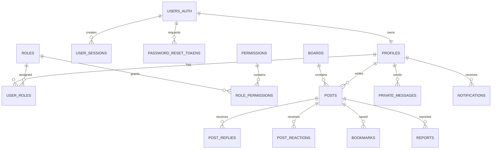

# BBS 数据库说明

本项目使用 MySQL 保存用户、帖子、回复、私信、通知和后台管理等业务数据。

## 1. 数据库环境

| 项目 | 配置 |
| --- | --- |
| 数据库产品 | MySQL Community Server（GPL） |
| 数据库版本 | **8.4.9** |
| 平台 | Win64 / x86_64 |
| 数据库名称 | `bbs_mysql` |
| Node.js 数据库驱动 | `mysql2 3.22.4` |
| 默认字符集 | `utf8mb4` |
| 数据库默认排序规则 | `utf8mb4_0900_ai_ci` |
| 表存储引擎 | InnoDB |

建表脚本使用 MySQL 8.x 语法，项目开发和测试使用 MySQL 8.4.9。

## 2. 文件说明

| 文件 | 用途 |
| --- | --- |
| [`bbs_mysql_all.sql`](bbs_mysql_all.sql) | 创建 `bbs_mysql`、数据表、视图、存储过程和基础数据 |
| [`seed_restore_data.sql`](seed_restore_data.sql) | 导入中文演示账号、板块、帖子、回复等数据 |
| [`../scripts/setup-local-mysql.ps1`](../scripts/setup-local-mysql.ps1) | 安装依赖、生成 `.env.local` 并导入 SQL |
| [`../scripts/start-all.ps1`](../scripts/start-all.ps1) | 检查或启动 MySQL、检查数据库结构并启动网站 |
| [`../src/lib/mysql.ts`](../src/lib/mysql.ts) | 创建应用使用的 MySQL 连接池 |

`supabase/` 目录属于项目早期迁移资料，当前 `main` 分支的运行数据库是 MySQL。

## 3. 连接配置

应用从项目根目录的 `.env.local` 读取连接信息：

```dotenv
MYSQL_HOST=127.0.0.1
MYSQL_PORT=3306
MYSQL_USER=root
MYSQL_PASSWORD=123456
MYSQL_DATABASE=bbs_mysql
```

变量说明：

| 变量 | 说明 |
| --- | --- |
| `MYSQL_HOST` | MySQL 服务地址 |
| `MYSQL_PORT` | MySQL 服务端口，默认 `3306` |
| `MYSQL_USER` | 数据库用户名 |
| `MYSQL_PASSWORD` | 数据库密码 |
| `MYSQL_DATABASE` | 应用数据库名，默认 `bbs_mysql` |

`.env.local` 已加入 `.gitignore`。请勿将真实数据库密码提交到 GitHub。

## 4. 初始化数据库

### 4.1 自动初始化

在项目根目录运行：

```powershell
npm run setup:mysql
```

默认参数为：

```text
Host     = 127.0.0.1
Port     = 3306
User     = root
Password = 123456
Database = bbs_mysql
```

如果本机配置不同，可以直接调用脚本并传入参数：

```powershell
powershell -ExecutionPolicy Bypass -File scripts/setup-local-mysql.ps1 `
  -Host 127.0.0.1 `
  -Port 3306 `
  -User root `
  -Password "你的MySQL密码" `
  -Database bbs_mysql
```

脚本会依次：

1. 检查 Node.js、npm 和 MySQL Client。
2. 执行 `npm install`。
3. 生成 `.env.local`。
4. 导入 `mysql/bbs_mysql_all.sql`。
5. 导入 `mysql/seed_restore_data.sql`。

### 4.2 手动初始化

PowerShell 不会直接处理传统 CMD 的 `<` 重定向，推荐通过 `cmd /c` 导入：

```powershell
$mysql = "C:\Program Files\MySQL\MySQL Server 8.4\bin\mysql.exe"

cmd /c "`"$mysql`" --default-character-set=utf8mb4 -h 127.0.0.1 -P 3306 -u root -p < mysql\bbs_mysql_all.sql"
cmd /c "`"$mysql`" --default-character-set=utf8mb4 -h 127.0.0.1 -P 3306 -u root -p < mysql\seed_restore_data.sql"
```

第一条命令会创建数据库并重建脚本管理的表。第二条命令导入演示数据。

> `bbs_mysql_all.sql` 包含 `DROP TABLE IF EXISTS`。在已有正式数据的数据库上重新执行前，必须先备份。

## 5. 启动与自动检查

推荐从项目根目录运行：

```powershell
npm run start:all
```

`start-all.ps1` 会：

1. 从 `.env.local` 读取数据库连接参数。
2. 查找 MySQL Client。
3. 尝试检查或启动 Windows MySQL 服务。
4. 等待数据库可以连接。
5. 检查 `users_auth` 表是否存在。
6. 仅在数据库结构不存在时导入 SQL。
7. 启动 Next.js 和 Socket.IO 服务。

强制重新执行全量导入：

```powershell
npm run start:all:force
```

该命令会重建脚本管理的表并恢复演示数据，只应在确认数据可以被覆盖时使用。

## 6. 版本与状态验证

### 6.1 查看安装程序版本

```powershell
& "C:\Program Files\MySQL\MySQL Server 8.4\bin\mysql.exe" --version
& "C:\Program Files\MySQL\MySQL Server 8.4\bin\mysqld.exe" --version
```

### 6.2 查看当前连接服务器版本

先连接数据库：

```powershell
& "C:\Program Files\MySQL\MySQL Server 8.4\bin\mysql.exe" `
  -h 127.0.0.1 -P 3306 -u root -p bbs_mysql
```

再执行：

```sql
SELECT VERSION() AS mysql_version;
SELECT DATABASE() AS current_database;
SHOW VARIABLES LIKE 'character_set_server';
SHOW VARIABLES LIKE 'collation_server';
```

`mysql.exe --version` 表示客户端程序版本；`SELECT VERSION()` 表示当前连接的 MySQL Server 版本。两者可能不同，应以 `SELECT VERSION()` 判断远程或当前运行实例。

### 6.3 检查数据库对象

```sql
USE bbs_mysql;

SHOW FULL TABLES;
SHOW PROCEDURE STATUS WHERE Db = 'bbs_mysql';

SELECT COUNT(*) AS base_table_count
FROM information_schema.tables
WHERE table_schema = 'bbs_mysql'
  AND table_type = 'BASE TABLE';

SELECT COUNT(*) AS view_count
FROM information_schema.tables
WHERE table_schema = 'bbs_mysql'
  AND table_type = 'VIEW';
```

按仓库当前全量 SQL，预期创建：

- 22 张基础表
- 1 个视图
- 4 个存储过程

## 7. 数据库对象

### 7.1 用户与权限

| 表名 | 作用 |
| --- | --- |
| `users_auth` | 邮箱、密码摘要和账号时间信息 |
| `profiles` | 用户名、昵称、头像、角色、等级、积分和签名 |
| `roles` | 角色定义 |
| `permissions` | 权限定义 |
| `role_permissions` | 角色与权限关系 |
| `user_roles` | 用户与角色关系 |
| `user_sessions` | 登录 Session Token 和过期时间 |
| `password_reset_tokens` | 密码重置令牌 |

### 7.2 论坛内容

| 表名 | 作用 |
| --- | --- |
| `boards` | 论坛板块、分组、图标、颜色、排序和统计 |
| `posts` | 帖子标题、摘要、正文、标签、状态和统计 |
| `post_replies` | 帖子回复和可见状态 |
| `post_reactions` | 点赞等帖子互动 |
| `bookmarks` | 用户收藏帖子 |
| `notices` | 全站公告或板块公告 |

### 7.3 社交与通知

| 表名 | 作用 |
| --- | --- |
| `follows` | 用户关注关系 |
| `friendships` | 好友申请及处理状态 |
| `private_messages` | 私信内容、图片和已读状态 |
| `notifications` | 回复、好友、系统和举报通知 |

### 7.4 管理与成长

| 表名 | 作用 |
| --- | --- |
| `reports` | 帖子举报和处理状态 |
| `audit_logs` | 用户及后台操作审计记录 |
| `checkins` | 每日签到和奖励积分 |
| `grades` | 用户等级与最低积分要求 |

## 8. 主要数据关系



外键根据业务使用 `CASCADE`、`SET NULL` 或 `RESTRICT`：

- 用户认证数据删除后，相关用户资料和 Session 会级联删除。
- 帖子删除后，回复、互动、收藏和举报会按外键规则处理。
- 帖子作者被删除时，帖子作者字段可保留为空，避免强制删除帖子内容。
- 板块仍有帖子时使用限制规则，防止误删板块。

## 9. 视图与存储过程

### 9.1 视图

| 名称 | 作用 |
| --- | --- |
| `view_public_profiles` | 只返回允许公开展示的用户资料字段 |

### 9.2 存储过程

| 名称 | 作用 |
| --- | --- |
| `sp_create_post` | 创建帖子并更新板块帖子统计 |
| `sp_create_reply` | 创建回复并更新帖子回复统计 |
| `sp_toggle_post_reaction` | 添加或取消帖子互动 |
| `sp_toggle_bookmark` | 添加或取消帖子收藏 |

## 10. 应用如何访问数据库

数据库连接代码位于 `src/lib/mysql.ts`，使用 `mysql2/promise` 创建连接池：

- 应用连接池上限：12
- 自定义 Socket.IO 服务连接池上限：10
- 字符集：`utf8mb4`
- 开启等待连接：`waitForConnections: true`

数据访问层提供：

- `queryRows`：查询多行
- `queryOne`：查询单行
- `execute`：执行参数化 SQL
- `executeResult`：获取写操作结果
- `withTransaction`：自动提交或回滚事务

业务 SQL 使用 `?` 占位符传递参数，不直接拼接用户输入。

## 11. 备份与恢复

### 11.1 备份结构和数据

```powershell
& "C:\Program Files\MySQL\MySQL Server 8.4\bin\mysqldump.exe" `
  -h 127.0.0.1 -P 3306 -u root -p `
  --default-character-set=utf8mb4 `
  --routines --single-transaction `
  bbs_mysql > bbs_mysql_backup.sql
```

### 11.2 恢复备份

```powershell
$mysql = "C:\Program Files\MySQL\MySQL Server 8.4\bin\mysql.exe"
cmd /c "`"$mysql`" --default-character-set=utf8mb4 -h 127.0.0.1 -P 3306 -u root -p bbs_mysql < bbs_mysql_backup.sql"
```

备份文件可能包含账号和私信等敏感数据，不应直接提交到公开仓库。

## 12. 生产环境建议

- 为应用创建独立 MySQL 用户，不要使用 `root`。
- 只授予应用所需数据库权限。
- 修改或删除所有演示账号。
- 定期备份 `bbs_mysql`。
- 使用防火墙限制 MySQL 端口来源。
- 远程连接应使用 TLS。
- 不要将 `.env.local`、数据库备份或真实密码提交到 GitHub。
- 执行全量 SQL 或 `start:all:force` 前必须确认备份可用。

示例应用账号创建语句应根据部署环境调整主机范围和密码：

```sql
CREATE USER 'bbs_app'@'localhost' IDENTIFIED BY '请替换为高强度密码';
GRANT SELECT, INSERT, UPDATE, DELETE, EXECUTE
ON bbs_mysql.* TO 'bbs_app'@'localhost';
FLUSH PRIVILEGES;
```

## 13. 常见问题

### 找不到 `mysql` 命令

将以下目录加入系统 `PATH`：

```text
C:\Program Files\MySQL\MySQL Server 8.4\bin
```

也可以在命令中直接使用 `mysql.exe` 的完整路径。

### 无法连接 `127.0.0.1:3306`

检查服务状态：

```powershell
Get-Service | Where-Object {
  $_.Name -like "MySQL*" -or $_.DisplayName -like "*MySQL*"
}
```

再检查 `.env.local` 中的主机、端口、用户和密码是否与 MySQL 实际配置一致。

### 中文数据乱码

导入时添加：

```text
--default-character-set=utf8mb4
```

并检查：

```sql
SHOW VARIABLES LIKE 'character_set%';
SHOW VARIABLES LIKE 'collation%';
```

### 数据库已有数据，是否可以重新执行全量 SQL

不建议直接执行。`bbs_mysql_all.sql` 会删除并重建脚本管理的对象，应先使用 `mysqldump` 完整备份。
