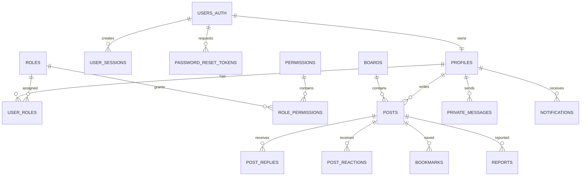

# BBS 数据库说明

本项目使用 MySQL 保存论坛系统中的用户资料、板块、帖子、回复、好友关系、私信、通知以及后台管理数据。项目使用的数据库为 MySQL Community Server 8.4.9，数据库名称为 `bbs_mysql`，默认字符集为 `utf8mb4`，排序规则为 `utf8mb4_0900_ai_ci`，数据表统一使用 InnoDB 存储引擎。Node.js 服务通过 `mysql2 3.22.4` 驱动访问数据库，建表脚本采用 MySQL 8.x 语法。

## 数据库文件

数据库目录中包含 `bbs_mysql_all.sql` 和 `seed_restore_data.sql` 两个主要文件。`bbs_mysql_all.sql` 用于创建数据库、数据表、外键、视图、存储过程和基础配置，`seed_restore_data.sql` 用于导入课程演示所需的用户、板块、帖子和回复等数据。项目根目录下的 `scripts/setup-local-mysql.ps1` 可以完成数据库初始化，`scripts/start-all.ps1` 则负责检查数据库连接、判断数据表是否存在并启动系统。

项目中还保留了 `supabase` 目录，其中的文件属于系统早期开发阶段的迁移资料。当前 `main` 分支实际使用的是 MySQL，运行本项目时不需要配置 Supabase。

## 连接配置

数据库连接信息保存在项目根目录的 `.env.local` 文件中，基本配置如下：

```dotenv
MYSQL_HOST=127.0.0.1
MYSQL_PORT=3306
MYSQL_USER=root
MYSQL_PASSWORD=123456
MYSQL_DATABASE=bbs_mysql
```

其中，`MYSQL_HOST` 和 `MYSQL_PORT` 分别表示数据库地址和端口，`MYSQL_USER` 与 `MYSQL_PASSWORD` 表示登录数据库使用的账号和密码，`MYSQL_DATABASE` 表示系统连接的数据库名称。示例中的密码只适用于本地开发，实际使用时应按照本机 MySQL 配置进行修改。`.env.local` 已经加入 `.gitignore`，不会上传到 GitHub。

## 数据库初始化

在 Windows 环境下，可以进入项目根目录并执行以下命令：

```powershell
npm run setup:mysql
```

该命令会安装项目依赖，生成 `.env.local`，然后依次导入建表脚本和演示数据。如果本机 MySQL 的账号、密码或端口与默认配置不同，可以直接调用初始化脚本并传入参数：

```powershell
powershell -ExecutionPolicy Bypass -File scripts/setup-local-mysql.ps1 `
  -Host 127.0.0.1 `
  -Port 3306 `
  -User root `
  -Password "你的MySQL密码" `
  -Database bbs_mysql
```

也可以使用 MySQL Client 手动导入。PowerShell 对传统输入重定向的处理方式与 CMD 不同，因此这里通过 `cmd /c` 执行：

```powershell
$mysql = "C:\Program Files\MySQL\MySQL Server 8.4\bin\mysql.exe"

cmd /c "`"$mysql`" --default-character-set=utf8mb4 -h 127.0.0.1 -P 3306 -u root -p < mysql\bbs_mysql_all.sql"
cmd /c "`"$mysql`" --default-character-set=utf8mb4 -h 127.0.0.1 -P 3306 -u root -p < mysql\seed_restore_data.sql"
```

建表脚本中包含删除并重新创建数据表的语句，因此不能直接在保存有正式数据的数据库中重复执行。需要重新导入数据库时，应先完成备份。

## 启动方式

数据库配置完成后，可以执行 `npm run start:all` 启动系统。启动脚本会读取 `.env.local`，检查 MySQL 是否可以连接，并判断 `users_auth` 表是否已经存在。如果数据库尚未初始化，脚本会自动导入 SQL；如果数据库结构已经存在，则直接启动 Next.js 和 Socket.IO 服务。

```powershell
npm run start:all
```

如果需要重新建立数据库并恢复演示数据，可以使用下面的命令：

```powershell
npm run start:all:force
```

该命令会重新执行全量 SQL，原有数据可能被覆盖，只适合课程演示环境或确认不需要保留现有数据的情况。

## 数据表设计

当前数据库包含 22 张基础表、1 个视图和 4 个存储过程。数据表按照用户权限、论坛内容、社交消息和后台管理四类业务进行组织。

用户和权限部分由 `users_auth`、`profiles`、`roles`、`permissions`、`role_permissions`、`user_roles`、`user_sessions` 和 `password_reset_tokens` 组成。`users_auth` 保存邮箱和密码摘要，`profiles` 保存用户昵称、头像、等级、积分和角色等公开资料。角色与权限采用关联表进行管理，用户登录后生成的会话信息保存在 `user_sessions` 中，密码重置令牌保存在 `password_reset_tokens` 中。

论坛内容部分由 `boards`、`posts`、`post_replies`、`post_reactions`、`bookmarks` 和 `notices` 组成。`boards` 保存论坛板块和排序信息，`posts` 保存帖子正文、标签、状态和浏览统计，`post_replies` 保存帖子回复，`post_reactions` 与 `bookmarks` 分别记录点赞和收藏操作，`notices` 用于保存全站公告或指定板块公告。

社交功能由 `follows`、`friendships`、`private_messages` 和 `notifications` 支持。关注关系与好友关系分别保存，私信表记录发送者、接收者、消息内容和已读状态，通知表用于保存回复通知、好友通知、系统通知和举报处理通知。

后台管理和用户成长部分包括 `reports`、`audit_logs`、`checkins` 和 `grades`。举报表记录用户提交的帖子举报及处理状态，审计日志记录发帖、回复以及后台管理操作，签到表保存每日签到和积分奖励，等级表用于配置不同积分对应的用户等级。

主要数据关系如下：



数据库通过外键维护数据关系。删除用户认证信息时，相关资料和会话会按照外键规则处理；删除帖子时，回复、互动、收藏和举报记录会同步处理；当帖子作者被删除时，帖子可以继续保留，只将作者字段设置为空；板块中仍有帖子时，外键会限制板块删除，防止内容失去所属板块。

## 视图和存储过程

数据库创建了 `view_public_profiles` 视图，用于查询可以公开展示的用户资料，避免直接返回邮箱、密码摘要等认证字段。

`sp_create_post` 用于创建帖子并更新板块帖子数量，`sp_create_reply` 用于创建回复并更新帖子回复数量，`sp_toggle_post_reaction` 用于添加或取消帖子点赞，`sp_toggle_bookmark` 用于添加或取消帖子收藏。这些存储过程将相关写操作放在同一个事务中，减少统计字段与业务数据不一致的情况。

## 程序访问方式

项目中的数据库连接代码位于 `src/lib/mysql.ts`。该文件通过 `mysql2/promise` 创建连接池，并提供查询多行、查询单行、执行写操作和事务处理等方法。应用连接池的最大连接数为 12，自定义 Socket.IO 服务使用的连接池最大连接数为 10。业务代码使用 `?` 占位符传递参数，不直接拼接用户提交的内容。

系统登录成功后会生成随机 Session Token，并写入 `user_sessions` 表。浏览器通过 HttpOnly Cookie 保存 Token，后续请求根据 Token 查询当前用户。Socket.IO 建立连接时也会读取同一个 Cookie，并在数据库中检查会话是否存在及是否过期。

## 数据库检查

启动 MySQL 后，可以使用以下命令连接数据库：

```powershell
& "C:\Program Files\MySQL\MySQL Server 8.4\bin\mysql.exe" `
  -h 127.0.0.1 -P 3306 -u root -p bbs_mysql
```

进入 MySQL 后，可以查看当前版本、数据库名称和数据库对象：

```sql
SELECT VERSION();
SELECT DATABASE();
SHOW FULL TABLES;
SHOW PROCEDURE STATUS WHERE Db = 'bbs_mysql';
SELECT COUNT(*) FROM users_auth;
SELECT COUNT(*) FROM posts;
```

如果系统可以打开但无法登录、发帖或发送私信，通常是因为 MySQL 服务没有启动、连接参数不正确或数据库表尚未导入。此时应先检查 `.env.local`，再检查 MySQL 服务状态：

```powershell
Get-Service | Where-Object {
  $_.Name -like "MySQL*" -or $_.DisplayName -like "*MySQL*"
}
```

如果导入后的中文内容出现乱码，应确认导入命令包含 `--default-character-set=utf8mb4`，并检查数据库字符集与排序规则。

## 备份与恢复

数据库可以使用 `mysqldump` 进行备份。下面的命令会同时导出数据表、数据和存储过程：

```powershell
& "C:\Program Files\MySQL\MySQL Server 8.4\bin\mysqldump.exe" `
  -h 127.0.0.1 -P 3306 -u root -p `
  --default-character-set=utf8mb4 `
  --routines --single-transaction `
  bbs_mysql > bbs_mysql_backup.sql
```

恢复备份时，可以运行：

```powershell
$mysql = "C:\Program Files\MySQL\MySQL Server 8.4\bin\mysql.exe"
cmd /c "`"$mysql`" --default-character-set=utf8mb4 -h 127.0.0.1 -P 3306 -u root -p bbs_mysql < bbs_mysql_backup.sql"
```

备份文件中可能包含用户账号、私信和其他业务数据，不应上传到公开仓库。正式部署时还应为应用创建独立的数据库账号，不使用 `root` 连接，并定期备份数据库。
